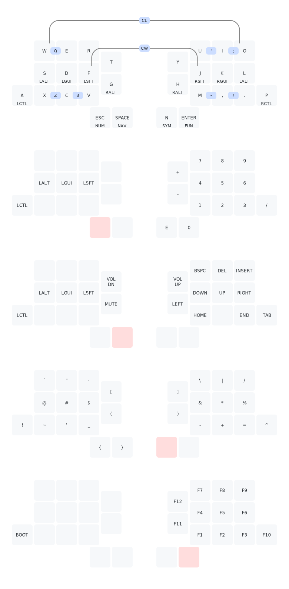
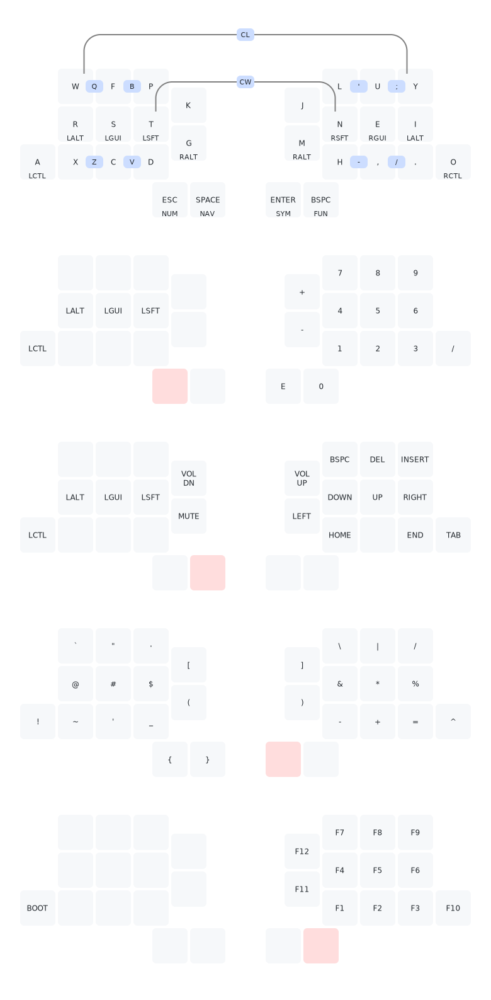
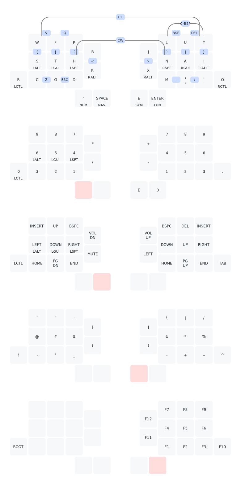

# Example Keymaps
Some example beginners' keymaps for getting you started quickly, plus the wonderful [aptmak](https://github.com/apsu/aptmak) by [apsu](https://github.com/apsu).
Consider trying out the latter if you're up for a change!

## Zilpzalp'd Qwerty

## Zilpzalp'd Colemak

## Zilpzalp'd [Aptmak](https://github.com/apsu/aptmak)

